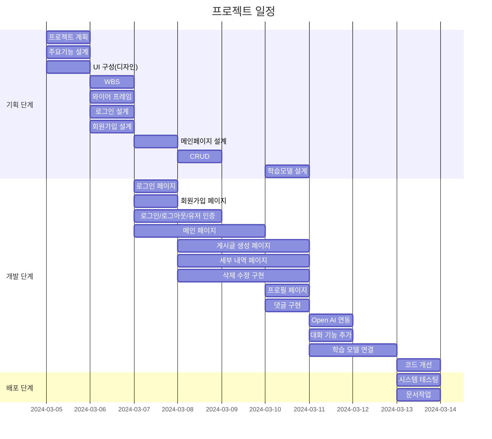

# ✈️ Travel
<p align="center">
<!--이미지 공간-->
</p>

## 📝 Django Project 

<strong>"여행 일정을 작성해 봅시다"</strong>

길었던 코로나19 시기가 끝나고 자유롭게 여행을 떠나고 싶지만 여행 계획을 작성하기 힘든 여행자들을 위한 여행 일정 추천 서비스.


## 1. 목표와 기능
### 1.1 목표
- 여행 일정 작성의 고민 시간 감소.
- 유명 관광 명소 추천으로 방문 만족도 증가.
- 새로운 여행지 추천으로 다양한 경험 제공.

### 1.2 기능
- 챗봇을 통한 실시간 대화 기능 제공.
- 카테고리를 통한 그룹별 차별화된 여행 일정 제공
- 방문 장소 시각화 자료 제공.


## 2. 개발 환경 및 배포 URL
### 2.1 개발 환경
- Visual Studio Code

### 2.2 배포 URL
- 예정
- 테스트용 계정
  ```
  id : test
  pw : 
  ```


## 3. 요구사항 명세와 기능 명세 


## 4. 프로젝트 구조와 개발 일정
### 4.1 프로젝트 구조


### 4.2 개발 일정(WBS)

