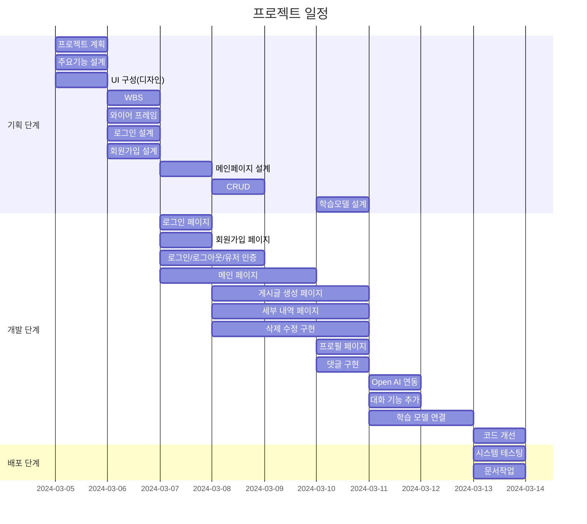

# ✈️ Travel
<p align="center">
<!--이미지 공간-->
</p>

## 📝 Django Project 

<strong>"여행 일정을 작성해 봅시다"</strong>

길었던 코로나19 시기가 끝나고 자유롭게 여행을 떠나고 싶지만 여행 계획을 작성하기 힘든 여행자들을 위한 여행 일정 추천 서비스.


## 1. 목표와 기능
### 1.1 목표
- 여행 일정 작성의 고민 시간 감소.
- 유명 관광 명소 추천으로 방문 만족도 증가.
- 새로운 여행지 추천으로 다양한 경험 제공.

### 1.2 기능
- 챗봇을 통한 실시간 대화 기능 제공.
- 카테고리를 통한 그룹별 차별화된 여행 일정 제공
- 방문 장소 시각화 자료 제공.


## 2. 개발 환경 및 배포 URL
### 2.1 개발 환경
- Visual Studio Code

### 2.2 배포 URL
- 예정
- 테스트용 계정
  ```
  id : test
  pw : 
  ```

### 2.3 URL 구조(모놀리식)
- register

| App       | URL                                        | Views Function    | HTML File Name                        | Note           |
|-----------|--------------------------------------------|-------------------|---------------------------------------|----------------|
| register  | 'signup/'                                  | user_signup       | register/signup.html                  | 회원가입<br>프로필 이미지 추가         |
| register  | 'login/'                                   | user_login        | register/login.html                   | 로그인           |
| register  | 'logout/'                                  | user_logout       |                                       | 로그아웃         |
| register  | 'profile/'                                 | user_profile      | register/user_profile.html            | 비밀번호변경기능<br>프로필 수정<br>닉네임추가 |


- post

| App       | URL                                        | Views Function    | HTML File Name                        | Note           |
|-----------|--------------------------------------------|-------------------|---------------------------------------|----------------|
| post      | '/'                                        | post_list         | post/post_list.html                   | 메인 페이지     |
| post      | 'create/'                                  | post_create       | post/post_create.html                 | 게시글 생성 페이지          |
| post      | 'detailPage/'                              | post_detail_list  | post/post_detail_list.html            | 세부 내역 목록 페이지         |
| post      | '<int:pk>/'                                | post_detail       | post/post_detail.html                 | 세부 내역 페이지 |
| post      | '<int:pk>/update'                          | post_update       | post/post_create.html                 | 게시글 수정     |
| post      | '<int:pk>/delete'                          | post_delete       | post/post_detail.html                 | 게시글 삭제     |
| post      | 'add_reply/<int:comment_id>/'              | add_reply         | post/post_detail.html                 | 댓글 / 대댓글 생성 |
| post      | 'delete_comment/<int:comment_id>'          | delete_comment    | post/post_detail.html                 | 댓글 삭제       |
| post      | 'update_comment/<int:comment_id>'          | update_comment    | post/post_detail.html                 | 댓글 수정       |
| post      | 'toggle_favorite/<int:pk>'                 | toggle_favorite   | post/post_detail.html                 | 즐겨찾기        |
| post      | 'get_ai_response'                          | get_ai_response   | post/post_create.html                 | GPT 응답        |


### 2.4 URL 구조(마이크로식)

|app:register|HTTP Method|설명|로그인 권한 필요|작성자 권한 필요|
|:-|:-|:-|:-:|:-:|
|signup/|POST|회원가입|||
|login/|POST|로그인|||
|logout/|POST|로그아웃| ✅ ||
|\<int:pk\>/|GET|프로필 조회| ✅ ||
|\<int:pk\>/|PUT|프로필 수정| ✅ | ✅ |
<br>  

|app:post|HTTP Method|설명|로그인 권한 필요|작성자 권한 필요|
|:-|:-|:-|:-:|:-:|
|/|GET|메인| ||
|create/|POST|게시물 작성| ✅ ||
|detailPage/|POST|게시물 세부 리스트| ||
|<int:pk>/|POST|게시물 확인| ✅ | ✅ |
|<int:pk>/update/|POST|게시물 수정| ✅ | ✅ |
|<int:pk>/delete/|POST|게시물 삭제| ✅ | ✅ |
|add_reply/<int:comment_id>/|POST|댓글 / 대댓글 생성| ✅ | |
|delete_comment/<int:comment_id>/|POST|댓글 삭제 | ✅ | ✅ |
|update_comment/<int:comment_id>/|POST|댓글 수정 | ✅ | ✅ |
|toggle_favorite/<int:pk>/|GET|즐겨찾기 추가/제거| ✅ | ✅ |
|get_ai_response/|POST|GPT 응답| ✅ | |
<br>


## 3. 요구사항 명세와 기능 명세 


## 4. 프로젝트 구조와 개발 일정
### 4.1 프로젝트 구조


### 4.2 개발 일정(WBS)

