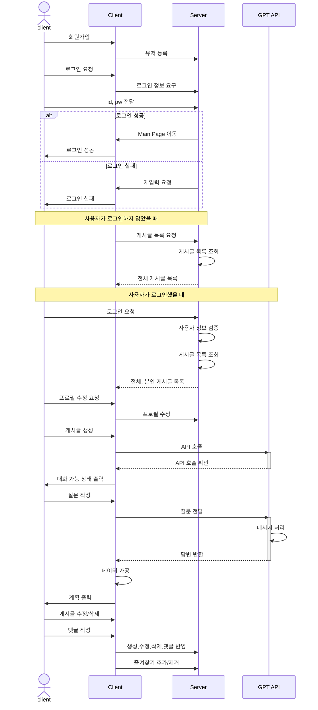
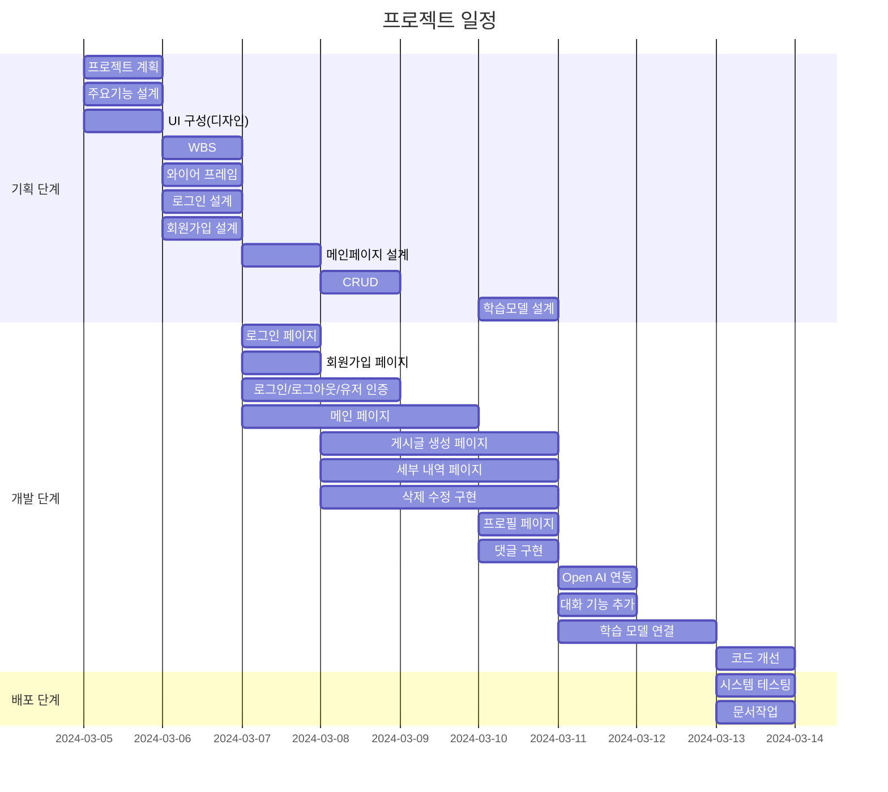
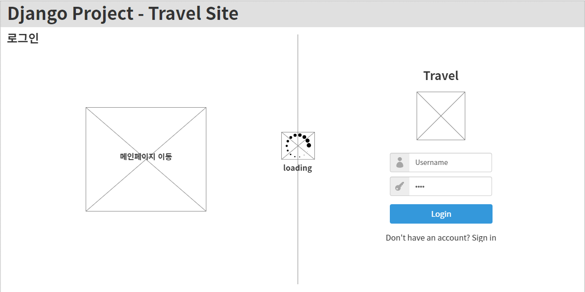
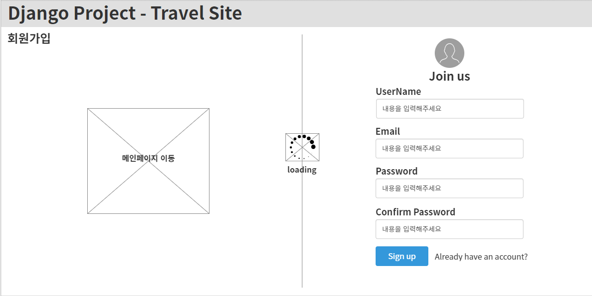
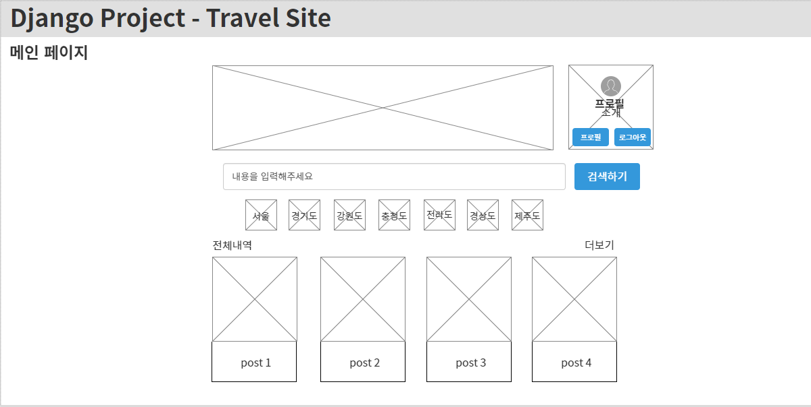
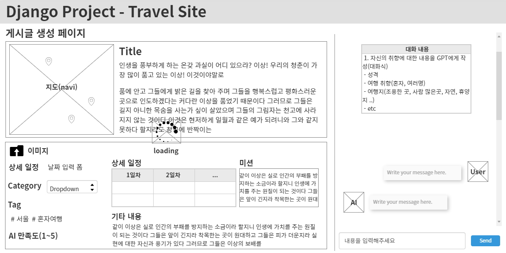
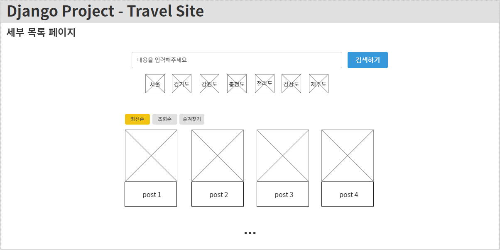
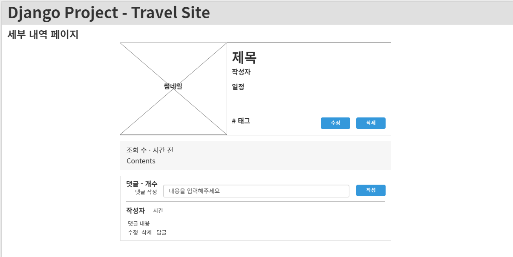
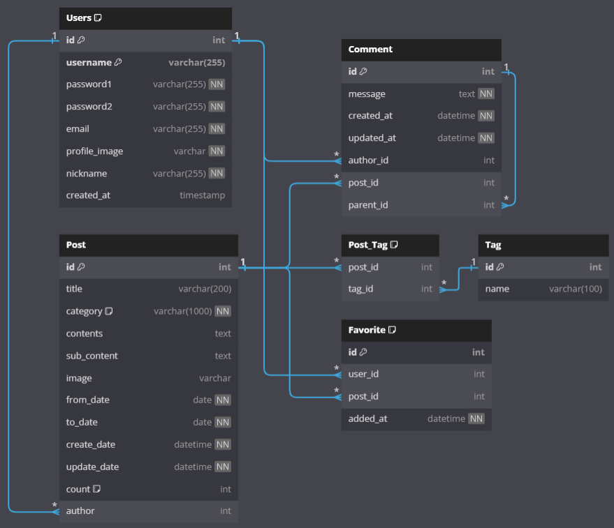
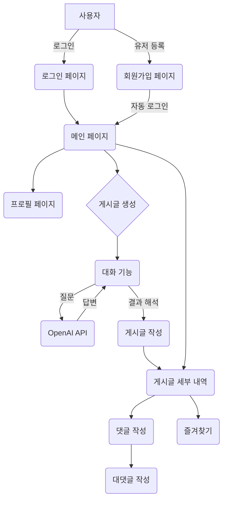

# ✈️ Travel
<p align="center">

</p>

## 📝 Django Project 

<strong>"여행 일정을 작성해 봅시다"</strong>

길었던 코로나19 시기가 끝나고 자유롭게 여행을 떠나고 싶지만 여행 계획을 작성하기 힘든 여행자들을 위한 여행 일정 추천 서비스.


## 1. 목표와 기능
### 1.1 목표
- 여행 일정 작성의 고민 시간 감소.
- 유명 관광 명소 추천으로 방문 만족도 증가.
- 새로운 여행지 추천으로 다양한 경험 제공.

### 1.2 기능
- 챗봇을 통한 실시간 대화 기능 제공.
- 카테고리를 통한 그룹별 차별화된 여행 일정 제공
- 방문 장소 시각화 자료 제공.


## 2. 개발 환경 및 배포 URL
### 2.1 개발 환경
- Visual Studio Code

### 2.2 배포 URL
- 예정
- 테스트용 계정
  ```
  id : test
  pw : 
  ```

### 2.3 URL 구조(모놀리식)
- register

| App       | URL                                        | Views Function    | HTML File Name                        | Note           |
|-----------|--------------------------------------------|-------------------|---------------------------------------|----------------|
| register  | 'signup/'                                  | user_signup       | register/signup.html                  | 회원가입<br>프로필 이미지 추가         |
| register  | 'login/'                                   | user_login        | register/login.html                   | 로그인           |
| register  | 'logout/'                                  | user_logout       |                                       | 로그아웃         |
| register  | 'profile/'                                 | user_profile      | register/user_profile.html            | 비밀번호변경기능<br>프로필 수정<br>닉네임추가 |


- post

| App       | URL                                        | Views Function    | HTML File Name                        | Note           |
|-----------|--------------------------------------------|-------------------|---------------------------------------|----------------|
| post      | '/'                                        | post_list         | post/post_list.html                   | 메인 페이지     |
| post      | 'create/'                                  | post_create       | post/post_create.html                 | 게시글 생성 페이지          |
| post      | 'detailPage/'                              | post_detail_list  | post/post_detail_list.html            | 세부 내역 목록 페이지         |
| post      | '<int:pk>/'                                | post_detail       | post/post_detail.html                 | 세부 내역 페이지 |
| post      | '<int:pk>/update'                          | post_update       | post/post_create.html                 | 게시글 수정     |
| post      | '<int:pk>/delete'                          | post_delete       | post/post_detail.html                 | 게시글 삭제     |
| post      | 'add_reply/<int:comment_id>/'              | add_reply         | post/post_detail.html                 | 댓글 / 대댓글 생성 |
| post      | 'delete_comment/<int:comment_id>'          | delete_comment    | post/post_detail.html                 | 댓글 삭제       |
| post      | 'update_comment/<int:comment_id>'          | update_comment    | post/post_detail.html                 | 댓글 수정       |
| post      | 'toggle_favorite/<int:pk>'                 | toggle_favorite   | post/post_detail.html                 | 즐겨찾기        |
| post      | 'get_ai_response'                          | get_ai_response   | post/post_create.html                 | GPT 응답        |


### 2.4 URL 구조(마이크로식)

|app:register|HTTP Method|설명|로그인 권한 필요|작성자 권한 필요|
|:-|:-|:-|:-:|:-:|
|signup/|POST|회원가입|||
|login/|POST|로그인|||
|logout/|POST|로그아웃| ✅ ||
|\<int:pk\>/|GET|프로필 조회| ✅ ||
|\<int:pk\>/|PUT|프로필 수정| ✅ | ✅ |
<br>  

|app:post|HTTP Method|설명|로그인 권한 필요|작성자 권한 필요|
|:-|:-|:-|:-:|:-:|
|/|GET|메인| ||
|create/|POST|게시물 작성| ✅ ||
|detailPage/|POST|게시물 세부 리스트| ||
|<int:pk>/|POST|게시물 확인| ✅ | ✅ |
|<int:pk>/update/|POST|게시물 수정| ✅ | ✅ |
|<int:pk>/delete/|POST|게시물 삭제| ✅ | ✅ |
|add_reply/<int:comment_id>/|POST|댓글 / 대댓글 생성| ✅ | |
|delete_comment/<int:comment_id>/|POST|댓글 삭제 | ✅ | ✅ |
|update_comment/<int:comment_id>/|POST|댓글 수정 | ✅ | ✅ |
|toggle_favorite/<int:pk>/|GET|즐겨찾기 추가/제거| ✅ | ✅ |
|get_ai_response/|POST|GPT 응답| ✅ | |
<br>


## 3. 요구사항 명세와 기능 명세 


## 4. 프로젝트 구조와 개발 일정
### 4.1 프로젝트 구조
```
📦travel
 ┣ 📂media  
 ┃ ┣ 📂posts  
 ┃ ┣ 📂users 
 ┣ 📂register  
 ┃ ┣ 📂migrations  
 ┃ ┣ 📂__pycache__  
 ┃ ┣ 📜admin.py  
 ┃ ┣ 📜apps.py  
 ┃ ┣ 📜forms.py  
 ┃ ┣ 📜models.py  
 ┃ ┣ 📜tests.py  
 ┃ ┣ 📜urls.py  
 ┃ ┣ 📜views.py  
 ┃ ┗ 📜__init__.py  
 ┣ 📂post  
 ┃ ┣ 📂migrations  
 ┃ ┣ 📂__pycache__  
 ┃ ┣ 📜admin.py  
 ┃ ┣ 📜apps.py  
 ┃ ┣ 📜forms.py  
 ┃ ┣ 📜models.py  
 ┃ ┣ 📜tests.py  
 ┃ ┣ 📜urls.py  
 ┃ ┣ 📜views.py  
 ┃ ┗ 📜__init__.py  
 ┣ 📂static  
 ┃ ┣ 📂assets  
 ┃ ┃ ┗ 📂img
 ┃ ┣ 📂css  
 ┃ ┃ ┣ 📜loding.css    
 ┃ ┃ ┣ 📜style.css    
 ┃ ┃ ┗ 📜register.css   
 ┃ ┣ 📂js
 ┃ ┃ ┣ 📜chatbot.js    
 ┃ ┃ ┣ 📜comment.js
 ┃ ┃ ┣ 📜loading.js    
 ┃ ┃ ┣ 📜post.js
 ┃ ┃ ┣ 📜register.js    
 ┃ ┃ ┣ 📜slider-img.js  
 ┃ ┃ ┗ 📜tab.js  
 ┣ 📂templates
 ┃ ┣ 📂base  
 ┃ ┃ ┣ 📜base_login.html  
 ┃ ┃ ┗ 📜base.html
 ┃ ┣ 📂post  
 ┃ ┃ ┣ 📜post_create.html  
 ┃ ┃ ┣ 📜post_detail_list.html  
 ┃ ┃ ┣ 📜post_detail.html  
 ┃ ┃ ┗ 📜post_list.html   
 ┃ ┣ 📂register  
 ┃ ┃ ┣ 📜login.html  
 ┃ ┃ ┣ 📜signup.html  
 ┃ ┃ ┗ 📜user_profile.html
 ┣ 📂tutorialdjango
 ┃ ┣ 📂__pycache__  
 ┃ ┣ 📜asgi.py  
 ┃ ┣ 📜settings.py  
 ┃ ┣ 📜urls.py  
 ┃ ┣ 📜wsgi.py  
 ┃ ┗ 📜__init__.py  
 ┣ 📜CONVENTION.md  
 ┣ 📜db.sqlite3  
 ┣ 📜manage.py  
 ┣ 📜README.md  
 ┣ 📜requirements.txt  
 ┗ 📜venv.txt  
```

### 4.2 개발 일정(WBS)



## 5. 와이어프레임 / UI

### 5.1 와이어프레임
<table border="1" style="width:100%;">
  <colgroup>
    <col style="width: 50%;">
    <col style="width: 50%;">
  </colgroup>
    <tbody>
        <tr>
            <td>로그인</td>
            <td>회원가입</td>
        </tr>
        <tr>
            <td>
		        
            </td>
            <td>
                
            </td>
        </tr>
        <tr>
            <td>프로필</td>
            <td>메인</td>
        </tr>
        <tr>
           <td>
                
            </td>
	     <td>
                
            </td>
        </tr>
        <tr>
            <td>게시글 생성</td>
            <td>세부 내역 목록</td>
        </tr>
        <tr>
            <td>
                
            </td>
            <td>
                
            </td>
        </tr>
        <tr>
            <td>세부 내역</td>
            <td></td>
        </tr>
        <tr>
            <td>
                
            </td>
            <td>
            </td>
        </tr>
    </tbody>
</table>


### 5.2 화면 설계
<table border="1" style="width:100%;">
  <colgroup>
    <col style="width: 50%;">
    <col style="width: 50%;">
  </colgroup>
    <tbody>
        <tr>
            <td>로그인</td>
            <td>회원가입</td>
        </tr>
        <tr>
            <td>
		        
            </td>
            <td>
                
            </td>
        </tr>
        <tr>
            <td>프로필</td>
            <td>메인</td>
        </tr>
        <tr>
           <td>
                
            </td>
	     <td>
                
            </td>
        </tr>
        <tr>
            <td>게시글 생성</td>
            <td>세부 내역 목록</td>
        </tr>
        <tr>
            <td>
                
            </td>
            <td>
                
            </td>
        </tr>
        <tr>
            <td>세부 내역</td>
            <td></td>
        </tr>
        <tr>
            <td>
                
            </td>
            <td>
            </td>
        </tr>
    </tbody>
</table>


## 6. 데이터베이스 모델링(ERD)
<p align="center">

</p>

## 7. Architecture


## 8. 메인 기능
여행 계획 작성 서비스는 사용자의 요청에 따라 사용자의  일정을 작성해주는 서비스로, OpenAI API를 통해 사용자의 요구사항에 맞는 일정을 생성하는 서비스입니다.
대화형 기능을 통해 사용자로부터 여행에 대한 구체적인 선호도와 요구사항을 파악하고 API를 통해 대화 내용에 따른 결과를 만듭니다. 
분석 결과가 반환되면 계획의 내용을 출력하고 지도를 활용하여 관광명소 및 맛집 위치를 표현합니다.





## 8. 에러


## 9. 느낀점 or 개선 사항 

